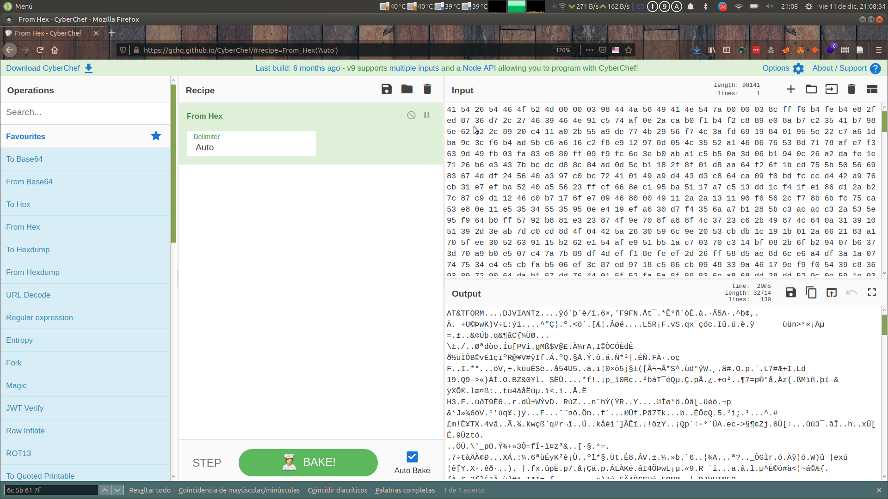
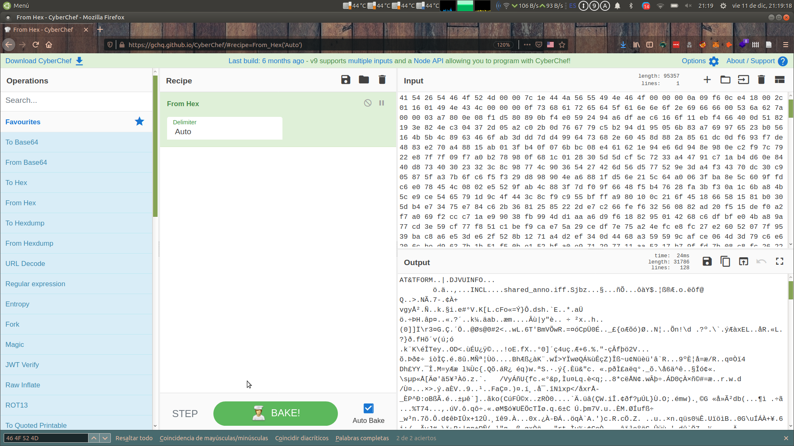
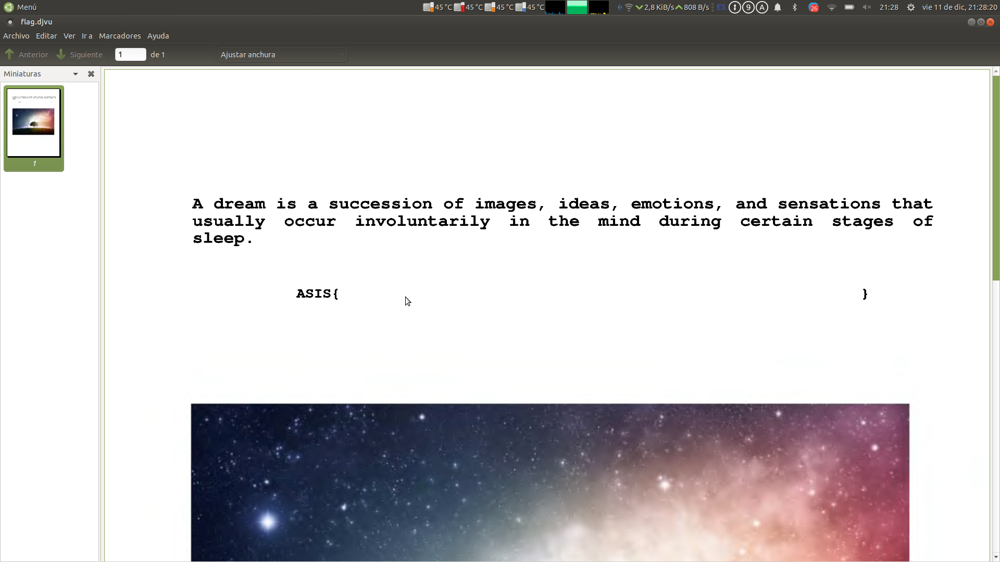

# Forenisc

## Dream

Nos dan un archivador con un archivo llamado flag.malformed si tiramos el comando file
```bash
file flag.malformed 
flag.malformed: data
```
No se reconocen los magic numbers veamos si en las strings hay algo reconocible:
```bash
strings -n 8 flag.malformed 
DJVIANTz
DJVUINFO
shared_anno.iff
VbKpj?L)f
;GSX5Uq"q:
*jG*j@|TWL>G
bM@XJ6qL
;>s:;0kIw
nrc20~[39Wb
_)pl-RLLQ
```
Centremosno en las tres legibles
```
DJVIANTz
DJVUINFO
shared_anno.iff
```
Un poco de research en google nos lleva a que DJVUINFO es parte del formato de archivos *.djvu*

Encontramos un toolkit completo de herramientas para tratar con estos files en el paquete *djvulibre-bin*

El primer comando de este toolkit que usaremos es *djvudump*
```
  DIRM [52] 
  NAVM [28] 
  FORM:DJVI [920] 
    ANTz [908]        Page annotation (hyperlinks, etc.)
  FORM:DJVU [31774] 
    INFO [10]         DjVu 2550x3300, v24, 300 dpi, gamma=2.2
    INCL [15]         Indirection chunk --> {shared_anno.iff}
    Sjbz [935]        JB2 bilevel data
    FGbz [15]         JB2 colors data, v0, 1 colors
    BG44 [4488]       IW4 data #1, 72 slices, v1.2 (color), 850x1100
    BG44 [3574]       IW4 data #2, 11 slices
    BG44 [7090]       IW4 data #3, 10 slices
    BG44 [15155]      IW4 data #4, 10 slices
    TXTz [412]        Hidden text (text, etc.)
```
Bien, parece que tenemos varios chunks,asi que hemos dado en el clavo, pero al intentar extraer cualquiera nos da errores :( , veamos más a fondo el formato a ver si es un tema de magic numbers, según Wikipedia son los siguientes:
```
41 54 26 54 46 4F 52 4D ?? ?? ?? ?? 44 4A 56
```
Que se traducen en:
```
AT&TFORM....DJV
```
Si checkeamos las strings del archivo vemos que hay 2 FORM sin nada delante y antes los chunks nos han sacado dos form, hagamos un poco de magia con cyberchef quitando los bytes del principio


Tras esto guardameos el archivo como cyberfoo.djvu
```
file cyberfoo.djvu 
cyberfoo.djvu: DjVu shared document
```
Parece que la operación ha tenido exito pero no se puede abrir :c 

Bueno no esta todo perdido, podemos sacar el primer chunk
```
djvuextract cyberfoo.djvu ANTz=ANTz
```
Y ademas tenemos otro FORM al que poner magic numbers, quizas asi podamos sacar algo mas, repitamos la operación


Tras esto guardameos el archivo como cyberfoo2.djvu
```
file cyberfoo2.djvu 
cyberfoo2.djvu: DjVu image or single page document
```
Sigue sin ser un archivo que podamos abrir pero nos sirve para sacar aun mas chuncks
```
djvuextract cyberfoo2.djvu Sjbz=Sjbz
djvuextract cyberfoo2.djvu FGbz=FGbz
djvuextract cyberfoo2.djvu BG44=BG44
djvuextract cyberfoo2.djvu TXTz=TXTz
```
Bien solo nos queda el tamaño para poder construir el djvu final para obtenerlo
```
djvudump cyberfoo2.djvu | grep INFO
    INFO [10]         DjVu 2550x3300, v24, 300 dpi, gamma=2.2
```
Con esto podemos restaurar el archivo ya que sabemos que parametros pasar a info
```
djvumake flag.djvu INFO=2550,3300,300 Sjbz=Sjbz FGbz=FGbz BG44=BG44 TXTz=TXTz ANTz=ANTz
```
Bien el archivo se puede abrir pero vaya joke:


Bien la flag esta escrita en blanco y no hay manera de leerla asi, vamos a seguir usando el toolkit de djvu
```
djvutxt flag.djvu 
ASIS{_DJVU_f1L3 _f0rM4t_iZ _DejaVu} 
ASIS{ 
} 
A dream is a succession of images, ideas, emotions, and sensations that 
usually occur involuntarily in the mind during certain stages of 
sleep. 
```
Aqui tenemos nuestra flag: **ASIS{_DJVU_f1L3 _f0rM4t_iZ _DejaVu}**
